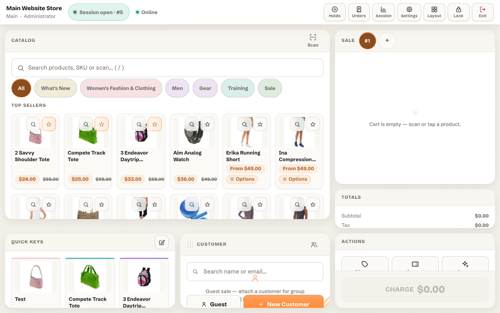
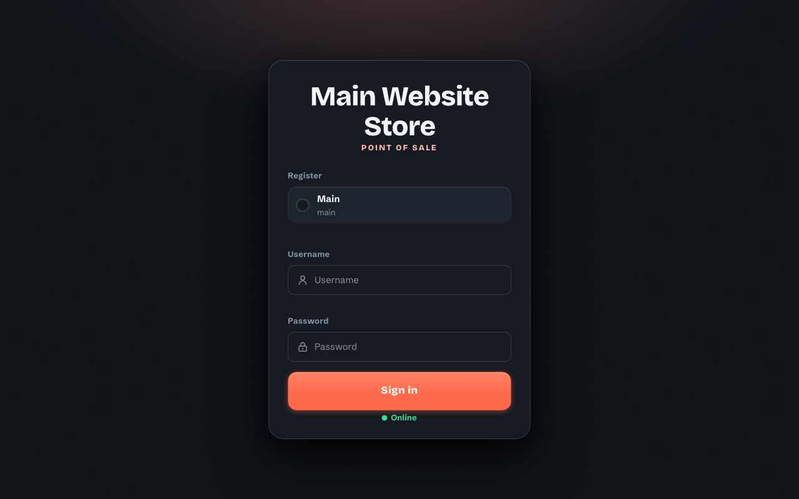

# Magento 2 MagePos Point of Sale

Panth MagePos (`Panth_MagePos`) adds an in-store point of sale to Magento 2. Cashiers use a standalone browser terminal served by the store at `/pos`; every sale is placed as a regular Magento order from a Magento quote. Registers, cashier accounts, roles, payment methods, quick keys, sessions and sales reports are managed in the Magento admin. The terminal page is rendered by the module itself, outside the storefront theme layout, so it does not depend on Luma or Hyva.

Product page: [kishansavaliya.com/magento-2-pos.html](https://kishansavaliya.com/magento-2-pos.html)



## Features

- Standalone terminal at `/pos` (Alpine.js and module CSS), with a login screen, light and dark themes and a per-user layout editor with the presets `classic`, `mirrored`, `catalog-max` and `compact`.
- POS users separate from admin users and customers: username and password login, PIN unlock after an idle auto-lock, lock state kept in the server session. Passwords and PINs are stored as `password_hash()` hashes.
- Roles with a maximum discount percent and the permissions `can_price_override`, `can_refund`, `can_open_close`, `can_cash_inout`, `can_custom_product`, `can_edit_layout` and `can_view_reports`.
- Register sessions with opening float, cash in/out movements, X report, and Z report on close with expected cash, counted cash and over/short.
- Product search, category browse, bestsellers, product options for configurable, grouped, bundle and custom-option products, barcode lookup by a configurable attribute (keyboard-wedge scanners, or camera scanning where the browser provides `BarcodeDetector`).
- Quick keys (product tiles with label, colour, page and position, global or per register), managed in admin or pinned from the terminal.
- Multiple carts, hold and restore, customer search and creation, cart notes.
- Cart and line discounts (percent or fixed), price override and Magento coupon codes, capped by the cashier role on the server.
- Custom sale lines backed by a placeholder product (`pos-custom-sale`, created on install).
- Split payments across cash, offline and online payment methods; change is calculated for cash rows. Online methods show a payment link and QR code and leave the order in pending payment.
- Receipts in 80 mm print layout (the Discount row includes the POS cart discount), email receipt (manual or automatic), receipt numbers in the form `{register_code}-{session_id}-{seq}`.
- Refunds from the terminal that create a Magento credit memo, with optional restock and a cash movement.
- Offline mode: catalog snapshot in IndexedDB, sales queued on the device and pushed when the connection returns, de-duplicated by a client UUID.
- Admin sales report (orders, gross, average order, by payment method, cashier, register and hour) and `POS Register` / `POS Cashier` columns in the sales order grid.
- Optional Multi-Source Inventory (MSI) support for salable quantity and restock by register source; falls back to legacy stock when MSI is not installed.

## Compatibility

| Component | Supported versions |
|---|---|
| Magento Open Source | 2.4.4 to 2.4.8 |
| Adobe Commerce | 2.4.4 to 2.4.8 |
| PHP | ~8.1.0, ~8.2.0, ~8.3.0, ~8.4.0 |

Composer constraints: `magento/framework` ^103.0, `magento/module-sales` ^103.0, `magento/module-quote` ^101.2, `magento/module-catalog` ^104.0, `magento/module-customer` ^103.0, `magento/module-payment` ^100.4, `magento/module-backend` ^102.0, `magento/module-ui` ^101.2. It also requires `mage2kishan/module-core` ^1.0 (`Panth_Core`).

## Requirements

- A browser on the till device with JavaScript and IndexedDB (IndexedDB is used for offline mode).
- Camera barcode scanning needs a browser that provides the `BarcodeDetector` API; keyboard-wedge scanners type into the search field and need no browser support.
- Receipts are printed through the browser print dialog. The print stylesheet targets 80 mm paper (72 mm printable width).

## Installation

```bash
composer require mage2kishan/module-mage-pos
bin/magento module:enable Panth_Core Panth_MagePos
bin/magento setup:upgrade
bin/magento setup:di:compile
bin/magento cache:flush
bin/magento setup:static-content:deploy -f
```

Run `setup:di:compile` only in production mode. Static content deployment is needed because the module ships frontend assets in `view/frontend/web`.

Check the module status:

```bash
bin/magento module:status Panth_MagePos
```

The install data patches create the roles `Administrator` (100% discount cap, all permissions) and `Cashier` (10% cap, no refund, no price override, no layout editing, no reports), a register `Main Register` (code `main`), the payment methods `cash`, `card` (offline, reference required) and `payment_link` (online), and the `pos-custom-sale` product. They also create a POS user `admin` that is disabled and has random, unusable password and PIN hashes. Set a password and PIN and enable that user (or create another) under POS Users before anyone can log in to the terminal.

## Configuration

Admin path: Stores > Configuration > Panth Extensions > Point of Sale (MagePos). Config paths start with `panth_pos/`. The same page is linked from the admin menu Panth Infotech > Point of Sale (MagePos) > Configuration.

### General (`panth_pos/general`)

| Field | Type | Default | Path | Notes |
|---|---|---|---|---|
| Enable Module | Yes/No | Yes | `panth_pos/general/enabled` | When No, `/pos` returns a "disabled" page and every `pos/*` JSON endpoint answers with the error code `disabled`. |
| Idle Auto-Lock (minutes) | Text | 5 | `panth_pos/general/idle_lock_minutes` | 0 disables auto-lock. Shown when Enable Module = Yes. |
| Default Register ID | Text | (empty) | `panth_pos/general/default_register` | Preselected register on the login screen. Shown when Enable Module = Yes. |

### Catalog & Barcode (`panth_pos/catalog`)

| Field | Type | Default | Path |
|---|---|---|---|
| Barcode Attribute Code | Text | sku | `panth_pos/catalog/barcode_attribute` |
| Search Page Size | Text | 20 | `panth_pos/catalog/search_page_size` |
| Show Out of Stock Products | Yes/No | No | `panth_pos/catalog/show_out_of_stock` |
| Offline Catalog Cache Limit | Text | 2000 | `panth_pos/catalog/offline_catalog_limit` |

### Customers (`panth_pos/customer`)

| Field | Type | Default | Path |
|---|---|---|---|
| Guest Checkout Email | Text | pos-guest@example.com | `panth_pos/customer/guest_email` |
| Default Customer Group | Select | 1 | `panth_pos/customer/default_customer_group` |

### Custom Products (`panth_pos/custom_product`)

| Field | Type | Default | Path |
|---|---|---|---|
| Placeholder Product SKU | Text | pos-custom-sale | `panth_pos/custom_product/sku` |
| Default Tax Class | Select | 2 | `panth_pos/custom_product/default_tax_class` |

### Checkout (`panth_pos/checkout`)

| Field | Type | Default | Path |
|---|---|---|---|
| Order Note Prefix | Text | POS | `panth_pos/checkout/order_note_prefix` |
| Auto-Invoice Offline Payments | Yes/No | Yes | `panth_pos/checkout/auto_invoice_offline` |
| Require Open Register Session | Yes/No | Yes | `panth_pos/checkout/require_session` |

When Require Open Register Session is No and no session is open, checkout opens a session automatically on the selected or default register with a zero float.

### Receipt (`panth_pos/receipt`)

| Field | Type | Default | Path |
|---|---|---|---|
| Receipt Logo URL | Text | (empty) | `panth_pos/receipt/logo` |
| Receipt Header Text | Textarea | (empty) | `panth_pos/receipt/header` |
| Receipt Footer Text | Textarea | Thank you for your purchase! | `panth_pos/receipt/footer` |
| Show Tax Breakdown | Yes/No | Yes | `panth_pos/receipt/show_tax_breakdown` |
| Auto-Email Receipt | Yes/No | No | `panth_pos/receipt/auto_email` |

Header and footer text set on a register override these values.

### Offline Mode (`panth_pos/offline`)

| Field | Type | Default | Path |
|---|---|---|---|
| Enable Offline Mode | Yes/No | Yes | `panth_pos/offline/enabled` |

### Register Sessions (`panth_pos/session`)

| Field | Type | Default | Path |
|---|---|---|---|
| Auto-Close Sessions After (hours) | Text | 24 | `panth_pos/session/auto_close_hours` |

This setting is not used in this version. Sessions are not closed automatically and the module has no cron job.

### Payment Methods

This group only contains a note. POS tenders are managed in the admin grid, and every POS order is recorded against the internal payment method `panth_pos` ("POS Payment", `payment/panth_pos`, not available in storefront checkout).

### Admin pages

Admin menu Panth Infotech > Point of Sale (MagePos):

| Menu item | Route | What it manages |
|---|---|---|
| Launch Terminal | `panth_pos/terminal/launch` | Redirects to `/pos` on the default store view. |
| Registers | `panth_pos/register/index` | Name, code, store view, status, inventory source, receipt header and footer. |
| Sessions | `panth_pos/session/index` | Session list, session detail with cash movements, force close. |
| POS Users | `panth_pos/user/index` | Username, name, email, role, status, password, PIN. |
| Roles | `panth_pos/role/index` | Maximum discount percent and permission flags (the grid shows a readable summary of the allowed actions). |
| Payment Methods | `panth_pos/method/index` | Code, title, type (cash, offline, online), active, sort order, icon, reference required, open drawer, instructions, payment URL template. |
| Quick Keys | `panth_pos/quickkey/index` | Product, label, colour, page, position, register. The product must exist and the colour must be a hex value (for example `#2563eb`). |
| Reports | `panth_pos/report/index` | Sales summary filtered by register and date range. |
| Configuration | system config section `panth_pos` | Settings above. |

The Registers, Sessions, POS Users, Roles, Payment Methods and Quick Keys grids have a keyword search box next to Filters. It matches register name and code; register, cashier and status; username, name and email; role name; method code, title and type; quick key label and colour.

## Usage

1. Open `/pos` on the store URL, or use Launch Terminal in the admin.
2. Log in with a POS user's username and password and pick a register. After the idle time the screen locks and the cashier unlocks with the PIN. Logout ends the POS session.
3. Open a register session with an opening float (requires `can_open_close`). Cash in/out needs `can_cash_inout`.
4. Add products by search, category, bestsellers, barcode or quick key. Configurable, grouped and bundle products and products with custom options open an option picker. Custom lines need `can_custom_product`; price override needs `can_price_override`.
5. Apply a cart or line discount (percent or fixed) or a coupon. The server rejects discounts above the role's maximum discount percent.
6. Attach a customer (search or create) or sell as guest using the configured guest email.
7. At checkout, split the total across any active payment methods. The cart is totalled with the store address from Stores > Configuration > General > Store Information (or the default country) and a zero priced shipping method, the same way the order is placed, so the cart total is the amount to pay. The payments must cover the grand total; change is only allowed on cash rows. Offline methods can require a reference. Online methods show the method's payment URL (built from its payment URL template) as a link and QR code, and the order stays in pending payment. The module has no payment page of its own: the `payment_link` method is created with an empty template, and an empty template (or the old `{{base_url}}pos/pay/...` default) shows the method's instructions instead of a link. Set the template to your payment provider's URL to show a link and QR code. Online processing can be extended through `Panth\MagePos\Api\PaymentProcessorInterface`.
8. The order is created from the quote with payment method `panth_pos`. When no online row is pending and Auto-Invoice Offline Payments is Yes, an offline-captured invoice is created. The order appears under Sales > Orders with the POS Register and POS Cashier columns.
9. Print the receipt (80 mm layout), email it, or reprint it later. The receipt page is served at `pos/checkout/receipt` and requires the per-order receipt token.
10. Refunds (requires `can_refund`): search the order by increment ID, customer email or receipt number, choose items and quantities, the refund payment split, restock and a reason. A Magento credit memo is created.
11. Take an X report at any time (requires `can_view_reports`; the button is hidden for roles without it). Close the session with the counted cash to get the Z report with over/short.

Sessions: the admin Sessions grid and the session detail page can force close an open session (counted cash set to expected cash). Force close is a POST request with the admin form key. Sessions are not closed automatically; close them at the terminal or force close them in the admin.

Offline mode: with Enable Offline Mode = Yes the terminal stores a catalog snapshot (up to Offline Catalog Cache Limit products) in IndexedDB. When the browser goes offline, search uses the local copy and completed sales are queued on the device, then sent to `pos/sync/push` when the connection returns. Each queued sale has a client UUID so a sale is not created twice. According to the user guide, creating customers, validating coupons and payment-link methods are not available while offline.



## Developer Notes

- Module: `Panth_MagePos`
- Package: `mage2kishan/module-mage-pos`
- Namespace: `Panth\MagePos`
- Depends on: `Panth_Core` (config tab and admin menu parent)

Services in `Service/`: `AuthService`, `CartService`, `CatalogService`, `CheckoutService`, `CustomerService`, `DiscountService`, `HoldService`, `PosSessionService`, `PreferenceService`, `ReceiptService`, `RefundService`, `ReportService`, `SyncService`. Repository interfaces for every entity are in `Api/`.

Quote and credit memo totals: `etc/sales.xml` adds the `pos_discount` collector to quote totals (sort order 420) and to credit memo totals (sort order 350).

Payment processors: register implementations of `Panth\MagePos\Api\PaymentProcessorInterface` in the `processors` argument of `Panth\MagePos\Model\Payment\ProcessorPool` via `di.xml`.

### Terminal endpoints

The module has no `etc/webapi.xml` and no Magento REST or GraphQL endpoints. The terminal calls JSON controllers on the frontend route `pos` (`etc/frontend/routes.xml`):

| Area | Paths | Method |
|---|---|---|
| Auth | `pos/auth/login`, `pos/auth/pin`, `pos/auth/lock`, `pos/auth/logout` | POST |
| Auth | `pos/auth/state` | GET |
| Cart | `pos/cart/create`, `add`, `update`, `remove`, `clear`, `coupon`, `custom`, `customer`, `discount`, `note` | POST |
| Cart | `pos/cart/get` | GET |
| Catalog | `pos/catalog/search`, `products`, `product`, `options`, `categories`, `bestsellers`, `barcode`, `quickkeys`, `snapshot` | GET |
| Catalog | `pos/catalog/quickkeySave`, `pos/catalog/quickkeyRemove` | POST |
| Checkout | `pos/checkout/place` | POST |
| Checkout | `pos/checkout/receipt` | GET |
| Customer | `pos/customer/search` (GET), `pos/customer/create` (POST) | |
| Hold | `pos/hold/all` (GET), `pos/hold/save`, `restore`, `remove` (POST) | |
| Order | `pos/order/search` (GET), `pos/order/preview`, `pos/order/refund` (POST) | |
| Preference | `pos/preference/load` (GET), `pos/preference/save` (POST) | |
| Register | `pos/register/all`, `current`, `xreport` (GET), `pos/register/open`, `close`, `movement` (POST) | |
| Sync | `pos/sync/push` | POST |

Authentication is the POS user stored in the Magento session (`panth_pos_user_id`), not an admin or customer login. POST endpoints validate the Magento form key. All endpoints except `pos/auth/login` and `pos/auth/state` require a logged-in, unlocked POS user (`pos/auth/state` returns the active registers for the login screen). All endpoints check Enable Module. Role permissions are checked on the server; `pos/register/xreport` requires `can_view_reports`.

Carts are scoped to the register of the cashier's open session: a cart created on another register is reported as not found. Refund preview and refund only accept POS orders, and only orders of the current register when a session is open.

Sign-in limits: after 5 failed password logins for a username (or 20 from one IP address) further logins are refused with HTTP 429 and the code `too_many_attempts` for 15 minutes. After 5 wrong PINs the POS user is signed out and must log in with username and password. The counters are kept in the Magento cache, so flushing the cache resets them.

### ACL

`Panth_MagePos::manage` with children `Panth_MagePos::terminal`, `registers`, `sessions`, `users`, `roles`, `methods`, `quickkeys`, `reports`, `refund` and `config`. `Panth_MagePos::refund` is declared but not checked by any admin page; terminal refunds use the role permission `can_refund`.

### Database

Tables: `panth_pos_register`, `panth_pos_role`, `panth_pos_user`, `panth_pos_session`, `panth_pos_cash_movement`, `panth_pos_payment_method`, `panth_pos_order`, `panth_pos_order_payment`, `panth_pos_hold`, `panth_pos_quick_key`, `panth_pos_user_preference`. Columns added to `quote`: `panth_pos_discount_type`, `panth_pos_discount_value`, `panth_pos_register_id`.

Email template: `panth_pos_receipt` ("POS Receipt").

### Unit tests

Tests are in `Test/Unit` (`AuthService`, `CheckoutService`, `DiscountService`, `PosSessionService`, `ReceiptService`, `SyncService`, `ProcessorPool`, quote total `PosDiscount`). From the Magento root:

```bash
vendor/bin/phpunit -c dev/tests/unit/phpunit.xml.dist vendor/mage2kishan/module-mage-pos/Test/Unit
```

The suite runs on PHPUnit 12 (the version required by Magento 2.4.9). Run it from `dev/tests/unit` if the Allure extension in `phpunit.xml.dist` reports a missing `allure/allure.config.php`; that warning comes from the Magento test configuration, not from the module.

## Uninstallation

```bash
bin/magento module:disable Panth_MagePos
composer remove mage2kishan/module-mage-pos
bin/magento setup:upgrade
bin/magento cache:flush
```

The module has no uninstall script. The `panth_pos_*` tables, the three `quote` columns, the `pos-custom-sale` product, the `panth_pos/*` and `payment/panth_pos/*` config values, and orders placed with the `panth_pos` payment method remain in the database.

## Support

- Product page: [kishansavaliya.com/magento-2-pos.html](https://kishansavaliya.com/magento-2-pos.html)
- Contact: [kishansavaliya.com/contact](https://kishansavaliya.com/contact)
- Email: kishansavaliyakb@gmail.com
- Issues: [github.com/mage2sk/module-mage-pos/issues](https://github.com/mage2sk/module-mage-pos/issues)

## Documentation

A cashier guide covering every terminal flow is in [USER_GUIDE.md](USER_GUIDE.md).

## License

MIT, as declared in `composer.json`. See [LICENSE](LICENSE) in this repository.

## Changelog

See [CHANGELOG.md](CHANGELOG.md).

## Links

- Website: [kishansavaliya.com](https://kishansavaliya.com)
- All extensions: [kishansavaliya.com/magento-extensions.html](https://kishansavaliya.com/magento-extensions.html)
- GitHub: [github.com/mage2sk/module-mage-pos](https://github.com/mage2sk/module-mage-pos)
- Packagist: [packagist.org/packages/mage2kishan/module-mage-pos](https://packagist.org/packages/mage2kishan/module-mage-pos)
